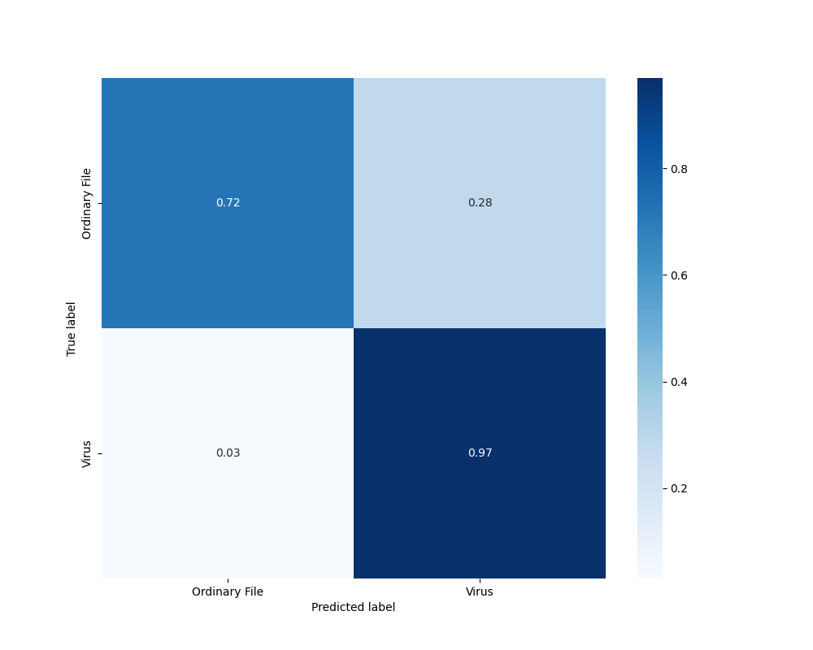

# Virus libs classifier
A machine-learning system that uses a list of statically imported .exe libraries of a file
predicts if the file is malicious.

There are three samples: 
- train 
- validation
- test

The samples are represented as tsv files with three columns:
- is_virus - whether the file is malicious: 1=yes, 0=no 
- filename - file name for review
- libs - comma separated list of libraries statically imported by this file (LIEF library is used to get the list).

## Resulting confusion matrix

